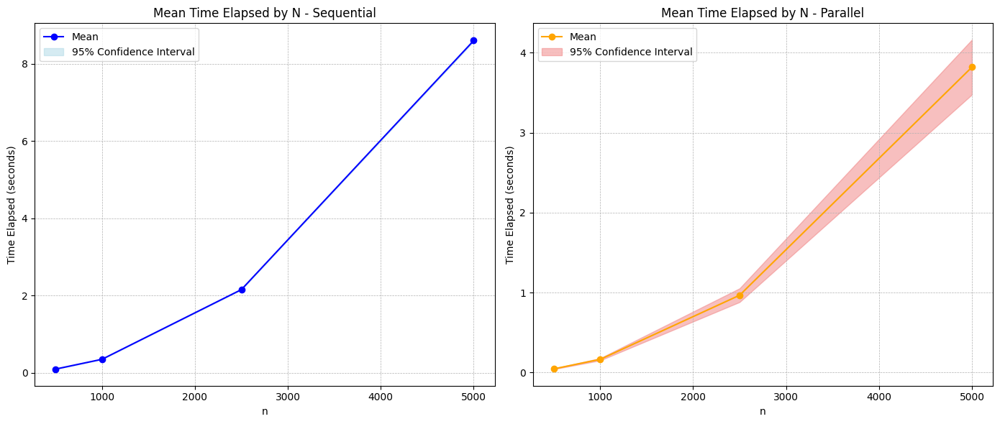
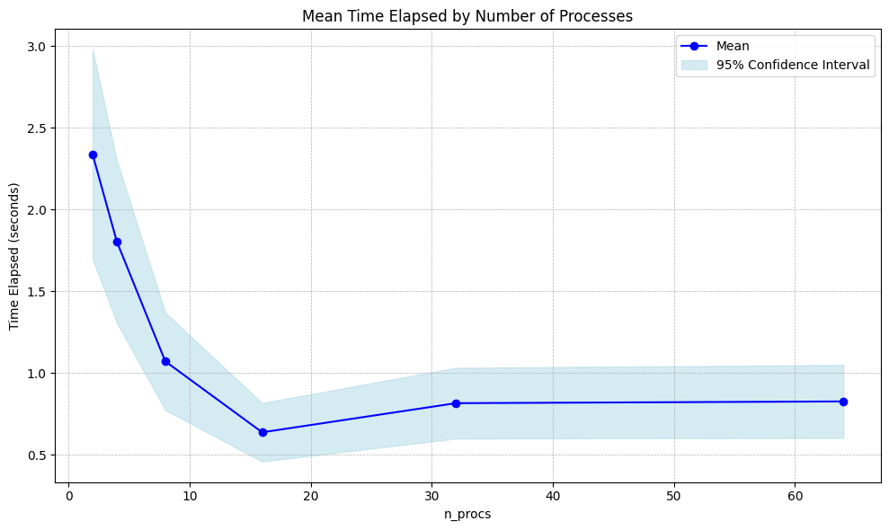
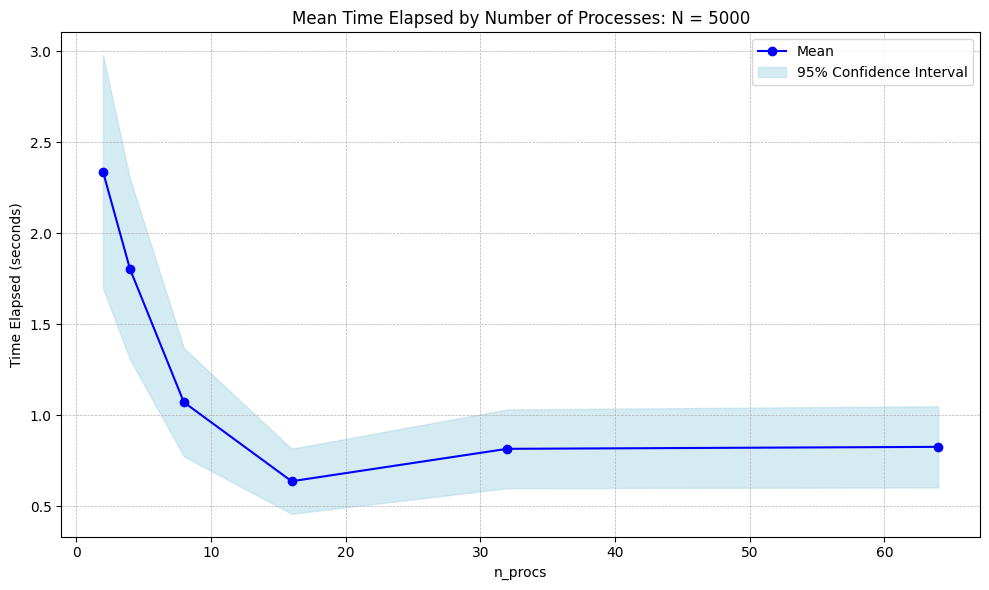
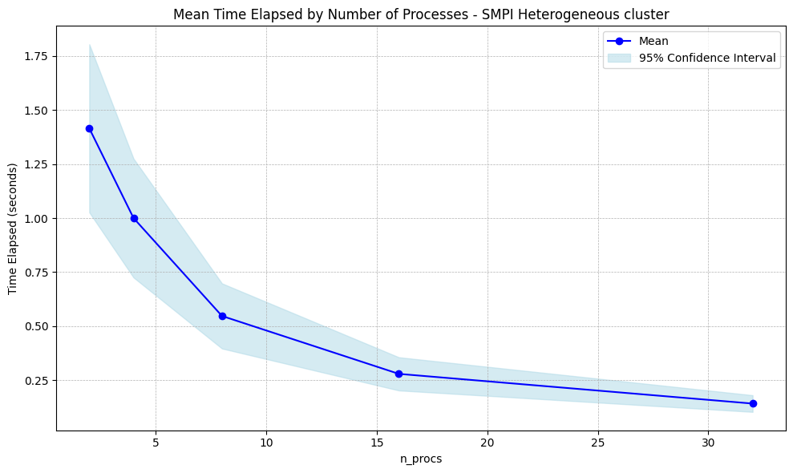
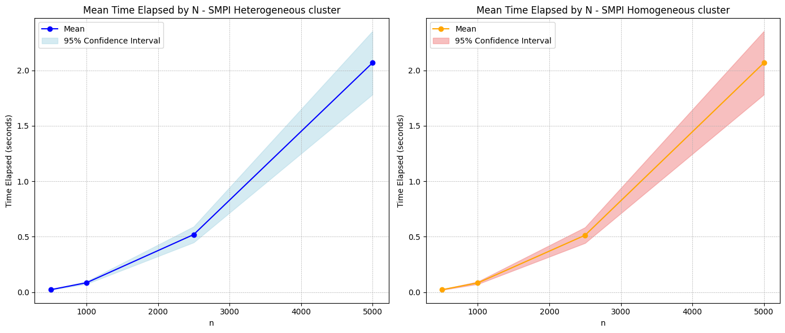
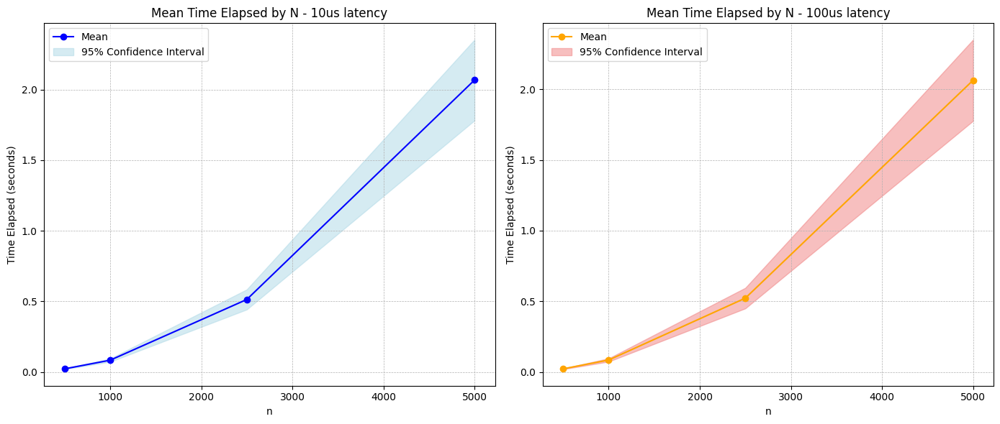
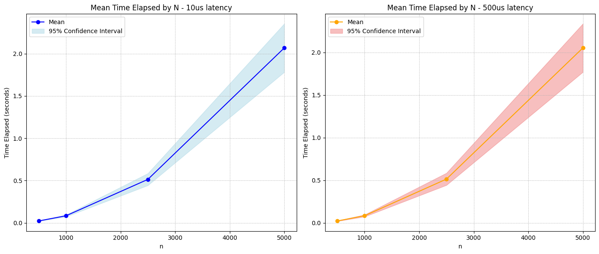
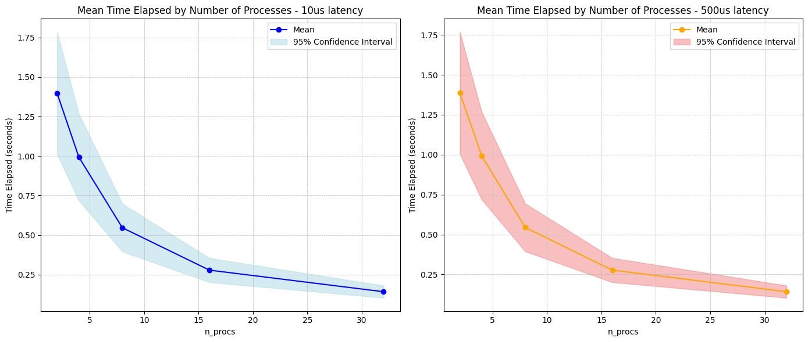

# Exercício-Programa 3: Mais Fractais


## Tarefa 3 - Experimentos  

Todos os dados gerados pelos experimentos encontram-se no arquivo `results.csv`. O processo de parsing, assim como a geração das imagens, encontram-se também no jupyter notebook `study.ipynb`.

### Experimentos com MPICH  

Configuração dos experimentos:

- Valores testados de `n` (entrada para tamanho da imagem): {500, 1000, 2500, 5000}

- Quantidade de execuções de cada experimento: 20.  

- Quantidade de iterações para cada imagem (`i`): 6.

- Número de processos (`n_procs`): $2*x$, onde x = {1...i}.

Para mais detalhes dos experimentos, veja `run_measurements.sh`.

#### Análise de desempenho  \

Primeiramente, o tempo de execução usado para comparação das versões paralelizadas será definido como o **maior** `elapsed_time` dos processos de uma respectiva amostra.

Calculando a média e mediana da versão sequencial e paralelizada:

```python
>>> dataframe.groupby("executable")["elapsed_time"].mean()
executable
1D_parallel_julia    1.249294
sequential_julia     2.797689
Name: elapsed_time, dtype: float64
```

```pytthon
>>> dataframe.groupby("executable")["elapsed_time"].median()
executable
1D_parallel_julia    0.380623
sequential_julia     1.243762
Name: elapsed_time, dtype: float64
```





A versão paralelizada possui seu tempo de execução mais rápido quando comparado com a versão sequencial. Além disso, para o conjunto de tamanhos `n`, o número de processos que atinge a menor média de tempo de execução é 16.

#### Cálculo do *speedup*  \

Calculando o speedup:

```python
>>> df_seq["elapsed_time"].mean()/df_mpi["elapsed_time"].mean()
np.float64(2.239416065261299)
```

Temos que o *speedup* da versão paralelizada vs versão sequencial é de aproximadamente **2.24x**.

#### Análise de eficiência  \

Selecionando todas execuções para `n=5000`:

```python
>>> df.groupby("n_procs")["elapsed_time"].mean()
n_procs
2.0     7.157784
4.0     5.538825
8.0     3.316751
16.0    1.988573
32.0    2.420791
64.0    2.492902
Name: elapsed_time, dtype: float64
```

```python
>>> df.groupby("n_procs")["elapsed_time"].median()
n_procs
2.0     7.156738
4.0     5.540824
8.0     3.316941
16.0    1.989621
32.0    2.356065
64.0    2.488144
Name: elapsed_time, dtype: float64
```



A maior eficiência ocorre para 16 processos, nota-se também uma ligeira degradação de desempenho para `n_procs>16`, que se estabiliza a partir desse valor.

### Experimentos com SimGrid  

Configuração dos experimentos:

- Valores testados de `n` (entrada para tamanho da imagem): {500, 1000, 2500, 5000}

- Quantidade de execuções de cada experimento: 20.  

- Quantidade de iterações para cada imagem (`i`): 5.

- Número de processos (`n_procs`): $2*x$, onde x = {1...i}.

#### Experimentos com cluster heterogêneo:  

- Configuração do cluster utilizada: `simple_cluster.xml`.
    - 64 nós.
    - Nível de latência entre nós: 10 µs.



Comparando com as mesmas especificações do cluster anterior, só que desta vez homogêneo:




```python
>>> df_smpi_heterog["elapsed_time"].mean()/df_smpi_homog["elapsed_time"].mean()
np.float64(1.004685352735828)
```

Pela relação acima, a versão homogênea é ligeiramente mais performática para o problema do conjunto de julia. No entanto, pode-se observar que a heterogeneidade do cluster não foi suficiente para causar problemas de desbalanceamento de carga ou aumentar a latência de comunicação.

#### Experimentos com cluster homogêneo:  

- Configuração do cluster utilizada: `simple_cluster_homogeneous.xml`.
    - 64 nós.
    - Níveis de latência entre nós testados: 10 µs, 100 µs e 500 µs.








```python
>>> df_smpi_homog["elapsed_time"].mean()/df_smpi_homog_100_lat["elapsed_time"].mean()
np.float64(0.9984293756357593)
```

```python
>>> df_smpi_homog["elapsed_time"].mean()/df_smpi_homog_500_lat["elapsed_time"].mean()
np.float64(1.0051140758125052)
```

Com o aumento da latência, era esperado mais ocorrências de atraso de comunicação e/ou sincronização ineficiente, porém, o conjunto de julia paralelizado requer a sincronização dos processos somente na escrita do arquivo, ou seja, além de ser um problema altamente paralelizável, seu maior custo está concentrado nas operações de entrada/saída, o que justifica o porquê de não haver mudanças significativas de desempenho.

## Conclusão  

Os experimentos realizados demonstram a eficiência da paralelização na geração de imagens do conjunto de Julia, com a versão paralelizada apresentando um *speedup* significativo de **2,24x** em relação à versão sequencial. A análise de eficiência revelou que o desempenho ótimo foi alcançado com 16 processos, sendo observado um leve declínio para valores maiores, possivelmente devido à sobrecarga de comunicação.

Os experimentos com clusters heterogêneos e homogêneos mostram que, para este problema específico, a heterogeneidade do cluster não afetou significativamente o desempenho, indicando que o problema é bem equilibrado em termos de carga computacional. Além disso, o aumento da latência no cluster homogêneo também não teve impacto substancial, uma vez que o custo maior está concentrado nas operações de entrada/saída, com menor dependência da comunicação entre processos.

Esses resultados reforçam que o problema do conjunto de Julia é altamente paralelizável, com gargalos de desempenho associados principalmente à escrita de arquivos e não à comunicação entre nós. A configuração de 16 processos se mostrou como a mais eficiente, proporcionando um equilíbrio ideal entre desempenho e *overhead*.