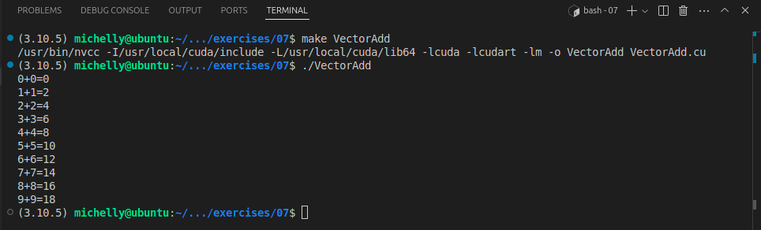

# Mini EP7 – Acessando um ambiente com GPUs

Para este mini exercício-programa, será utilizado minha máquina local, um notebook com uma GPU NVIDIA GeForce GTX 1650 de 4 GB de memória.

As configurações utilizadas são:

System Details Report
---

#### Report details
- **Date generated:**                          	2024-11-04 21:17:06

#### Hardware Information:
- **Hardware Model:**                          	Acer Nitro AN515-44
- **Memory:**                                  	16,0 GiB
- **Processor:**                               	AMD Ryzen™ 7 4800H with Radeon™ Graphics × 16
- **Graphics:**                                	AMD Radeon™ Graphics
- **Graphics 1:**                              	NVIDIA GeForce GTX 1650
- **Disk Capacity:**                           	1,3 TB

#### Software Information:
- **Firmware Version:**                        	V1.04
- **OS Name:**                                 	Ubuntu 24.04.1 LTS
- **OS Build:**                                	(null)
- **OS Type:**                                 	64-bit
- **GNOME Version:**                           	46
- **Windowing System:**                        	X11
- **Kernel Version:**                          	Linux 6.8.0-48-generic


Primeiramente, a instalação do CUDA Toolkit:

O próprio site possui um [manual de instalação](https://developer.nvidia.com/cuda-downloads?target_os=Linux&target_arch=x86_64&Distribution=Ubuntu&target_version=24.04&target_type=deb_local), porém a versão do driver da NVIDIA instalada pelo tutorial não é totalmente compatível com a minha máquina, e meu segundo monitor parou de ser detectado, então [removi toda a instalação](https://docs.nvidia.com/cuda/cuda-installation-guide-linux/index.html#removing-cuda-toolkit) e optei por instalar usando o [gerenciador de pacotes do Linux](https://docs.nvidia.com/cuda/cuda-installation-guide-linux/index.html#common-installation-instructions-for-ubuntu):


```shell
sudo apt install nvidia-cuda-toolkit
```

O comando anterior foi suficiente para executar os comandos `nvcc`, `nvdia-smi` e `nvprof`. Para rodar o `nvtop`, um `sudo apt  install nvtop` foi necessário.

Com isso, bastou executar `nvcc --version` para checar a instalação:

```shell
michelly@ubuntu:~/.../exercises/07$ nvcc --version
nvcc: NVIDIA (R) Cuda compiler driver
Copyright (c) 2005-2023 NVIDIA Corporation
Built on Fri_Jan__6_16:45:21_PST_2023
Cuda compilation tools, release 12.0, V12.0.140
Build cuda_12.0.r12.0/compiler.32267302_0
```

E `which nvcc` para pegar o path do `NVCC`:
```shell
michelly@ubuntu:~/.../exercises/07$ which nvcc
/usr/bin/nvcc
```

Alterações no `CUDAPATH` não foram necessárias.

Finalmente, prossegui para a execução do script `VectorAdd`:


